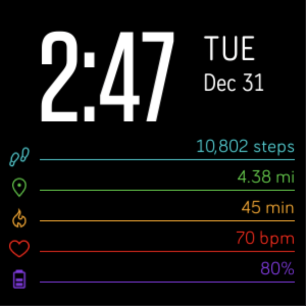
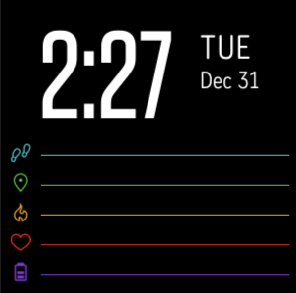

# Fitbit Clockface
A simple Fitbit clock face for Versa 2.
This project was created as a fun way to begin learning JavaScript and CSS.

## Screenshots

  

    
  

  

    
  

## Resources
- [metrix-fitbit clock face created by rootasjey](https://github.com/rootasjey/metrix-fitbit)
- [sdk-moment clock face created by Fitbit](https://github.com/Fitbit/sdk-moment)
- [sdk-design-assets created by Fitbit](https://github.com/Fitbit/sdk-design-assets)
- [Flaticon](https://www.flaticon.com/)
